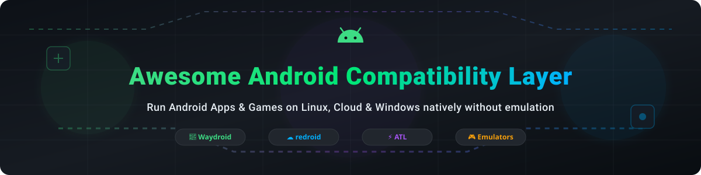

  

# 🚀 Awesome Android Compatibility Layer

  
  
  
  
  

> 📱 **Curated list of production-grade Android compatibility layers, containerized Android runtime solutions, API translation projects, and desktop Android emulators for Linux, Windows, and macOS.**

---

## 💡 Overview & Market Insights

Running Android applications on desktop and cloud platforms without traditional hardware emulation enables native CPU performance, lower RAM consumption, low-latency rendering, and seamless desktop integration.

> 📊 **Market Size & Industry Dynamics:**  
> The global **Android Compatibility Layer and Cloud Android (AiC) / Emulator Market** is estimated at **$1.8 Billion - $2.5 Billion USD** (2025–2026), driven by cross-platform mobile gaming on PC, Android-in-Cloud enterprise testing pipelines, and ARM-based Linux desktop adoption. The market is **moderately fragmented**: commercial gaming emulators (BlueStacks, Tencent GameLoop) dominate consumer desktop gaming, cloud-native container runtimes (redroid, Waydroid) lead developer and enterprise infrastructure, while open-source API translation layers (ATL) serve emerging lightweight Linux desktop use cases.

---

## 📋 Table of Contents

- [🏢 Commercial SaaS & Desktop Solutions](#-commercial-saas--desktop-solutions)
- [🔓 Open-Source GitHub Projects](#-open-source-github-projects)
  - [📦 Container-Based Android on Linux](#-container-based-android-on-linux)
  - [🔀 Translation-Based Approach & Libraries](#-translation-based-approach--libraries)
  - [☁️ Cloud Android & OS Ecosystems](#%EF%B8%8F-cloud-android--os-ecosystems)
- [🤝 How to Contribute](#-how-to-contribute)
- [⭐ Star History](#-star-history)
- [💖 Support & Sponsorship](#-support--sponsorship)
- [⚠️ Disclaimer](#%EF%B8%8F-disclaimer)

---

## 🏢 Commercial SaaS & Desktop Solutions

Below is a detailed comparison of commercial Android emulators and enterprise compatibility platforms, sorted by **estimated company valuation / revenue (descending)**:

| Product / Company 🏢 | Platform Support 💻 | Primary Use Case 🎯 | Specific Starting Price 💰 | Free Tier / Trial Limit ⏳ | Est. Valuation / Revenue 📈 |
| :--- | :--- | :--- | :--- | :--- | :--- |
| **[Tencent GameLoop](https://www.gameloop.com/)** | Windows | Mobile Gaming on PC | Free (Ad-supported / In-game items) | Free forever (100% free base player) | **~$600B Valuation** (Tencent Market Cap) |
| **[Windows Subsystem for Android](https://learn.microsoft.com/en-us/windows/android/wsa/)** | Windows 11 | Desktop Integration | Included with Windows 11 license | Included with Windows 11 *(Deprecated Mar 2025)* | **~$3.1T Valuation** (Microsoft Market Cap) |
| **[BlueStacks](https://www.bluestacks.com/)** | Windows, macOS | Mobile Gaming & Apps | $24.00/year (BlueStacks Premium / Ad-Free) | Free forever with ad banner support | **~$500M Valuation** (acquired by Now.gg / enterprise revenue >$100M) |
| **[Genymotion](https://www.genymotion.com/)** | Linux, Windows, macOS, Cloud | Enterprise Testing & CI/CD | $0.05/minute (Cloud) or $415/user/year (Desktop SaaS) | 30-day free trial (up to 100 cloud minutes limit) | **~$30M - $50M Valuation** (Genymobile SaaS revenue ~$10M/yr) |
| **[LDPlayer](https://www.ldplayer.net/)** | Windows | High-FPS Mobile Gaming | $2.99/month (LDPlayer Premium Ad-Free) | Free forever (ad-supported standard edition) | **~$20M - $40M Revenue** |
| **[NoxPlayer](https://www.bignox.com/)** | Windows, macOS | Mobile Gaming & Automation | $3.99/month (Premium VIP Ad-Free) | Free forever (ad-supported standard edition) | **~$15M - $30M Revenue** |
| **[MEmu Play](https://www.memuplay.com/)** | Windows | Multi-Instance Gaming | $2.99/month (Premium Membership) | Free forever (ad-supported standard edition) | **~$10M - $20M Revenue** |
| **[Andy](https://www.andyroid.net/)** | Windows, macOS | Desktop Android Integration | $29.00/month (Enterprise PRO version) | Free forever standard edition | **~$5M Revenue** *(Legacy maintenance)* |

---

## 🔓 Open-Source GitHub Projects

The open-source Android compatibility ecosystem features container-based runtimes, API translation layers, and low-level library loaders. Listed below, **sorted by GitHub Star Count (descending)**:

### 📦 Container-Based Android on Linux

-  **[Waydroid](https://github.com/waydroid/waydroid)**  
  **The premier open-source containerized Android compatibility layer for Linux (successor to Anbox).**  
  * **License**: GPL-3.0  
  * **Architecture**: Uses Linux namespaces (PID, IPC, UTS, Network, Mount) and LXC containers with direct LXC & Android Binder kernel interfaces.  
  * **Key Features**: Android 13 (LineageOS base); native Wayland window integration; zero-copy GPU acceleration (`zwp_linux_dmabuf_v1`); shares host CPU, RAM, and GPU for minimal performance overhead.  
  * **Distros**: Arch Linux, Ubuntu, Fedora, Debian, openSUSE, NixOS, Bazzite.

-  **[redroid (Remote-Android)](https://github.com/remote-android/redroid-doc)**  
  **GPU-accelerated Cloud Android-in-Cloud (AiC) container for Docker, Podman, and Kubernetes.**  
  * **License**: Apache-2.0  
  * **Architecture**: Multi-arch (`arm64` and `amd64`) Docker container images supporting Android versions 8.1 through 16.  
  * **Key Features**: Hardware GPU acceleration (`androidboot.redroid_gpu_mode`); optimized for cloud gaming servers, virtual Android device farms, and automated CI/CD testing pipelines.

-  **[Anbox](https://github.com/anbox/anbox)** *(Archived)*  
  **The historical pioneer of container-based Android execution on Linux.**  
  * **License**: GPL-3.0 *(Archived Feb 2024)*  
  * **Legacy Status**: Replaced by Waydroid. Required custom kernel modules (`binder`, `ashmem`) and stuck on Android 7.1 base.

### 🔀 Translation-Based Approach & Libraries

-  **[libhybris](https://github.com/droidian/libhybris)**  
  **Low-level POSIX-to-Bionic library compatibility wrapper for Linux.**  
  * **License**: Apache-2.0  
  * **Features**: Overrides Android's linker to call Bionic shared libraries (`.so`) directly from standard C library (`glibc`) host applications. Foundation for Sailfish OS and Ubuntu Touch.

-  **[Android Translation Layer (ATL)](https://gitlab.com/android_translation_layer/android_translation_layer)**  
  **Translates Android API calls directly to Linux desktop APIs without kernel modules or LXC containers.**  
  * **License**: GPL-3.0 / LGPL-3.0  
  * **Concept**: Operates like WINE for Windows binaries. Converts Android UI primitives directly into GTK components and routes audio/video through PipeWire/Mesa VA-API for ultra-low latency.

-  **[Lunaria](https://github.com/yui0/lunaria)**  
  **Experimental multi-OS translation layer for Android and iOS apps on Linux.**  
  * **Status**: Experimental (Supports Unity IL2CPP / UE4 APK binaries directly on Linux desktop).

-  **[ancmp](https://github.com/MFDGaming/ancmp)**  
  **Android dynamic library linker and compatibility interface based on Android Jellybean linker.**  
  * **Features**: Provides `android_dlsym` interface for loading Android native dynamic libraries into Windows & Linux executables.

### ☁️ Cloud Android & OS Ecosystems

-  **[Google Android Emulator Hypervisor Driver](https://github.com/google/android-emulator-hypervisor-driver)**  
  **Official hardware-accelerated hypervisor driver for running Android Emulator on Windows with AMD/Intel CPUs.**

-  **[Bliss OS / BlissRoms](https://github.com/BlissRoms/platform_manifest)**  
  **Open-source x86/x86_64 Android OS designed to run natively on PC hardware and tablets.**

---

## 🤝 How to Contribute

1. Fork this repository 🍴
2. Create your feature branch (`git checkout -b feature/amazing-compatibility-layer`)
3. Commit your changes (`git commit -m 'Add new open-source Android runtime'`)
4. Push to the branch (`git push origin feature/amazing-compatibility-layer`)
5. Open a Pull Request 🚀

Please check out [Awesome-Awesome-Awesome](https://github.com/ishandutta2007/Awesome-Awesome-Awesome) for more curated lists!

---

## ⭐ Star History

---

## 💖 Support & Sponsorship

If you find this repository helpful for your research, development, or Android desktop setup, please consider:
- 🌟 Giving a **Star** to this repository to increase visibility.
- 🔀 **Forking** it to keep your own copy and contribute improvements.
- 📢 **Sharing** this project with fellow Linux users and Android developers!

☕ **Buy me a coffee / Sponsor**: If you'd like to support ongoing open-source curation and projects, check out my [GitHub Sponsor Dashboard](https://github.com/sponsors/ishandutta2007). Thank you for your support! ❤️

---

## ⚠️ Disclaimer

* This is a **community-curated list** for educational, developer, and research purposes.
* Trademarks and project names belong to their respective commercial and open-source owners.
* Ensure proper container security controls when running containerized Android runtimes on untrusted apps or exposing cloud ADB ports.
